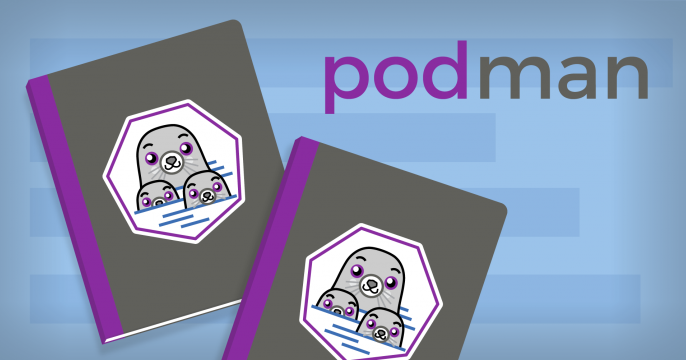

# Introduction to Container Technology with Podman

## Table of Contents

### Lab prerequisites

- [Prerequisites for Workshop](prereq.md)

### Lab 1

- [Container Quick Start with Podman](lab1/lab1.md)

### Lab 2

- [Container Basic Operation](lab2/lab2.md)

### Lab 3  

- [Build and Manage Container Image](lab3/lab3.md)

### Lab 4

- [Container lifecycle Management,  Network & Storage](lab4/lab4.md)
