# Container Basic Operation
<!-- TOC -->

- [Container Basic Operation](#container-basic-operation)
  - [List of Podman Command](#list-of-podman-command)
  - [Searching, pulling \& listing images](#searching-pulling--listing-images)
  - [Container Repository](#container-repository)
  - [Official Images](#official-images)
  - [Hardened Images](#hardened-images)
  - [Search images from Container Repository (DockerHub)](#search-images-from-container-repository-dockerhub)
  - [Running a container](#running-a-container)
  - [Listing running containers](#listing-running-containers)
  - [Testing the httpd container](#testing-the-httpd-container)
  - [Inspecting a running container](#inspecting-a-running-container)
  - [Viewing the container's logs](#viewing-the-containers-logs)
  - [Stopping the container](#stopping-the-container)
  - [Benefits of Knowing Podman Command Line](#benefits-of-knowing-podman-command-line)
  - [Back to Table of Content](#back-to-table-of-content)

<!-- /TOC -->

## List of Podman Command

- List of Podman Command --> https://docs.podman.io/en/stable/Commands.html

- To get some help and find out how Podman is working, you can use the help, 
  
  ```
  podman --help
  ```

  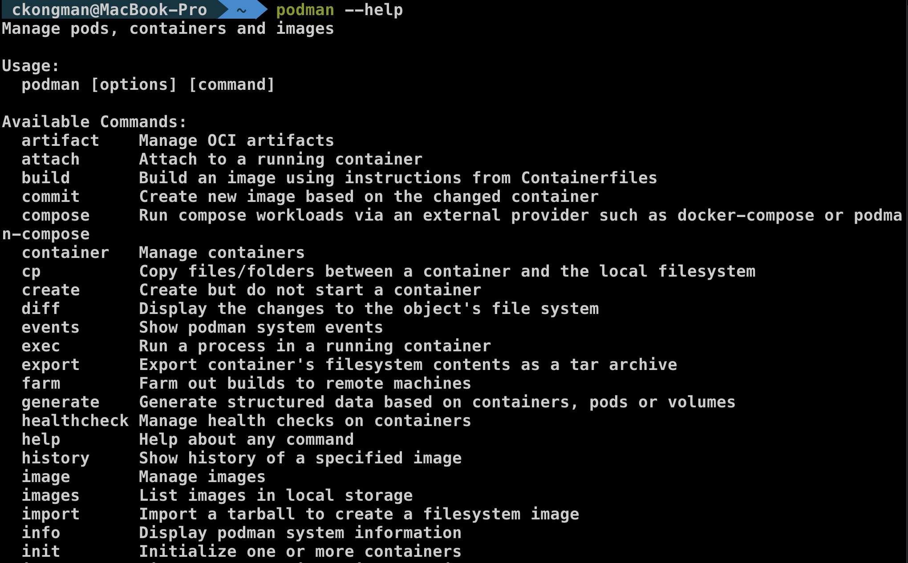  

## Searching, pulling & listing images

- List all images, present on your machine.
- Open your terminal or Command Prompt (CMD) or PowerShell 
- type below command or copy and paste to your terminal.
  
  ```
  podman images
  ```
  
  example output

  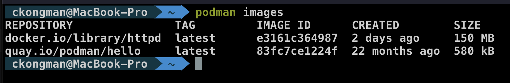 

- Podman can search for images on remote registries with some simple keywords.
- type below command or copy and paste to your terminal.
  
  ```
  podman search nginx
  ```

  example output, :D, As you can see, there are many images available. Which one should you use?

  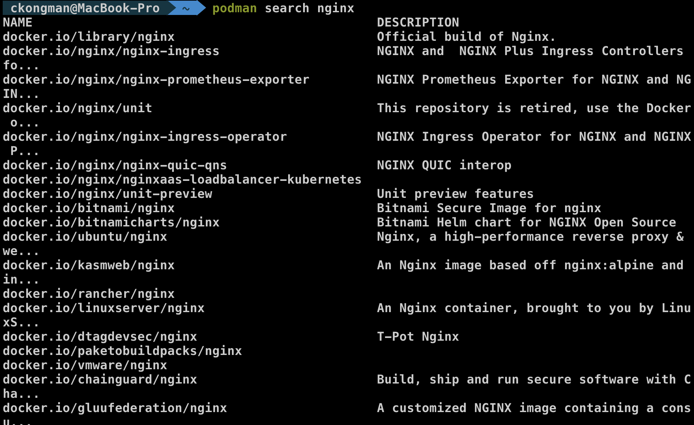 
  
- The podman search command allows you to find images in remote registries using the `--filter (or -f)` flag to narrow down results based on specific metadata. 

  Available Search Filters

  The following filters are officially supported by the podman-search command:
  
  - stars (int): Limits results to images with a minimum number of stars.
    
    `Example: podman search nginx --filter stars=100`

  - is-official (boolean): Filters for images that are "Official" (e.g., maintained by the software's original authors).

    `Example: podman search fedora --filter is-official=true`

  - is-automated (boolean): Filters for images that are built automatically from a source code repository.

    `Example: podman search alpine --filter is-automated=true`
  
- type below command or copy and paste to your terminal.
  
  ```
  podman search nginx --filter=is-official
  ```
  
  example output
  
  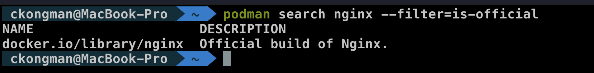 
  
- Downloading (Pulling) an image.
- type below command or copy and paste to your terminal.
  
  ```
  podman pull docker.io/library/nginx
  ```
  
  example output  

  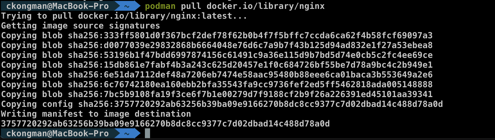

- After pulling some images, you can list all images, present on your machine.
- type below command or copy and paste to your terminal.
  
  ```
  podman images
  ```
  
  example output  
  
  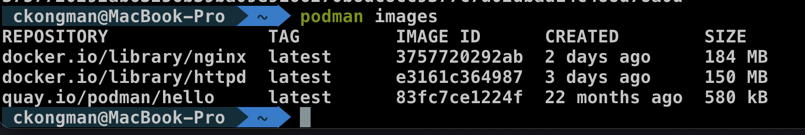 

## Container Repository

A container repository is a collection of related container images that provide different versions of an application. A container typically consists of a container image, which is a file that has everything a piece of software may need to run, such as multiple layers of code, resources and tools. Container repositories store images for setup and deployment. Organizations can use repositories to manage, pull and push images.

Container image repositories are an integral element of development and deployment practices for environments that use containers and plaform as a service. Most DevOps teams use containers and pull a variety of container images from numerous sources, such as open, community-focused registries, to enable more rapid and flexible application development.

An organization uses a container repository to share container images with its team or with the broader repository platform community. A public repository is shared with a larger community, while a private repository enables an organization to keep its images private within an account or team.

An example of a container repository is a Docker Repository on Docker Hub, which dedicates a location to the storage and publication of Docker images labeled with different tags. The tag identifies an image in a repository.

  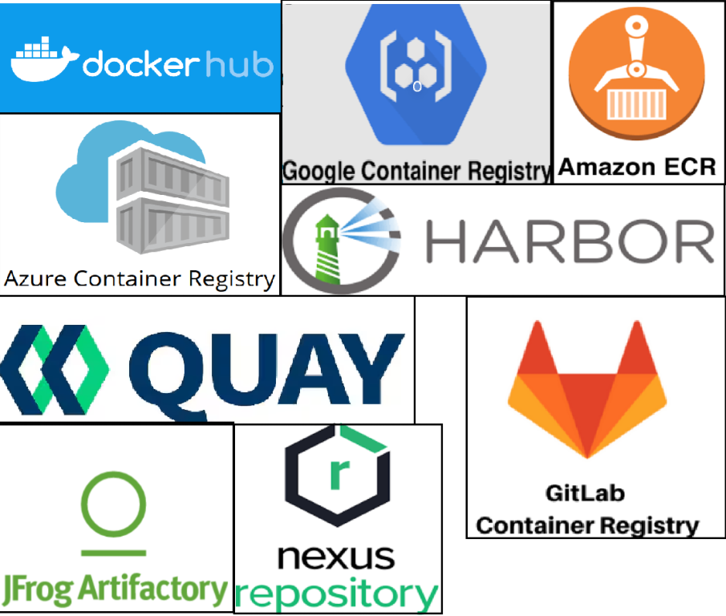

## Official Images

Official Images are a curated set of high-quality, secure repositories hosted on Repository. They serve as the foundational building blocks for most developers, providing essential operating systems, programming language runtimes, and data stores. 

Core Characteristics of Official Images

- Security: They are among the most secure images on the platform, typically having few or no known vulnerabilities (CVEs) and undergoing regular security scans.

- Best Practices: They exemplify Dockerfile best practices, such as using minimal base images and clear documentation.

- Multi-Architecture Support: Most official images support multiple architectures, including amd64, arm64, and sometimes Windows-based containers.

- Regular Updates: They are actively maintained and rebuilt frequently to include the latest security patches and software versions.

   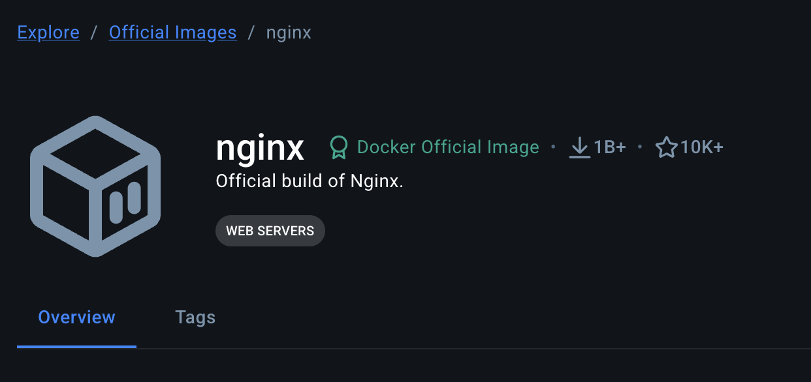 

## Hardened Images

Hardened Images (DHI) are a curated set of secure, minimal, and production-ready container images provided by Docker. They are designed to significantly reduce the attack surface and eliminate vulnerabilities compared to standard community images. 

Key Features

- Minimal Attack Surface: These images are often distroless, meaning they contain only the essential runtime dependencies. They typically omit shells (like bash/sh), package managers (apt/apk), and other unnecessary utilities, reducing the attack surface by up to 95%.

- Near-Zero CVEs: Docker maintains these images with a focus on having zero known vulnerabilities at the time of publication.

- Supply Chain Security: Every image includes a Software Bill of Materials (SBOM) and SLSA Level 3 provenance, allowing you to verify exactly what is in the image and how it was built.

- Non-Root by Default: Runtime variants are configured to run as a non-root user, improving overall container securit

   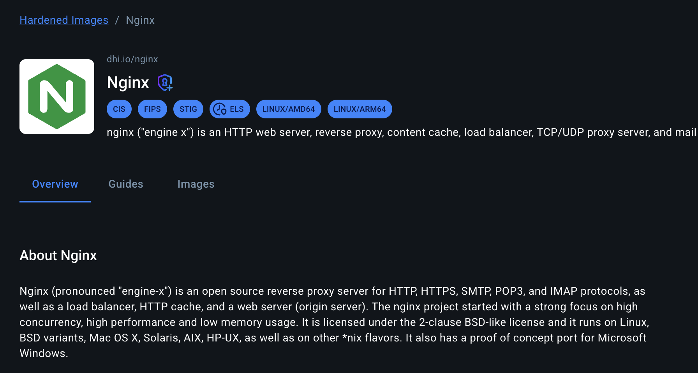 

## Search images from Container Repository (DockerHub)

- Open your browser, open https://hub.docker.com/
  
- Log in/Sign in with your account

- type `nginx` in Search box
  
  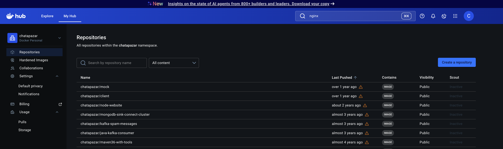 

- wait dockerhub auto image suggestion to you
  
  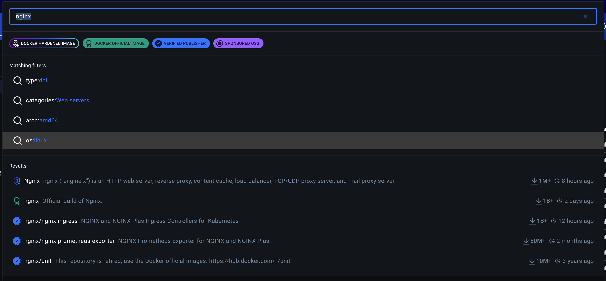 

- select nginx official image from suggestion list (`nginx` with green ribbon)
  
  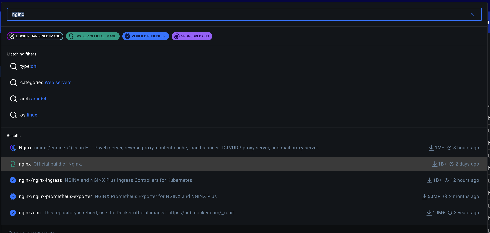
  
- View image overview, tag information, size, pull command
   
  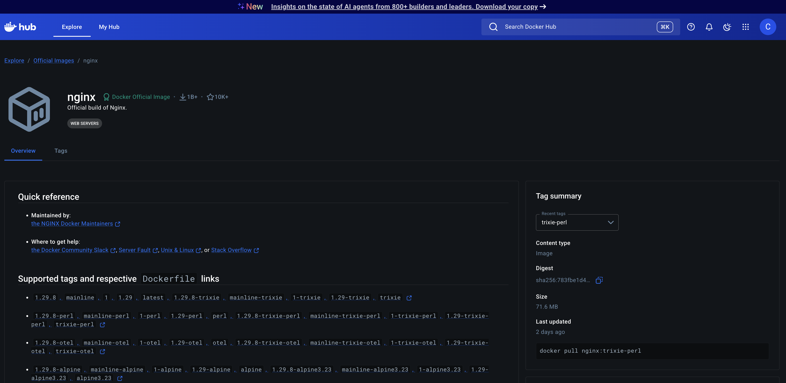  

- Click `Tags` tab, type `latest` to filter nignx image with tag: `latest`

- View pull command

  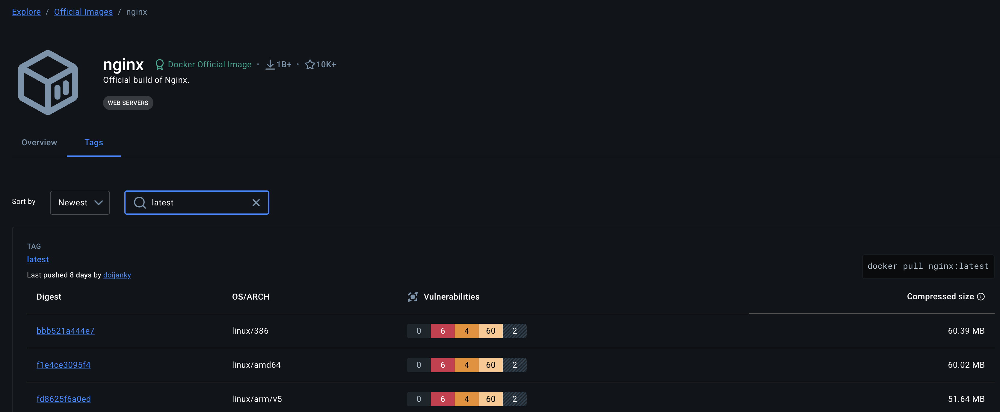  
  
## Running a container

- Verify podman run command
  
- type below command or copy and paste to your terminal.
  
  ```
  podman run --help
  ```
  
  example output    

  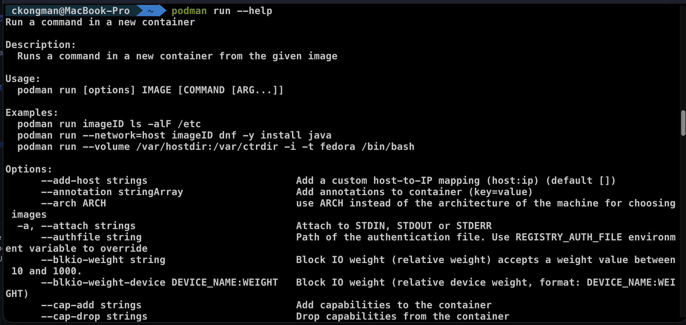  
  
- This sample container will run a very basic nginx server that serves only its index page.

- type below command or copy and paste to your terminal.
  
  ```
  podman run --name my-nginx -d -p 8080:80 docker.io/library/nginx
  ```
  
  example output    

  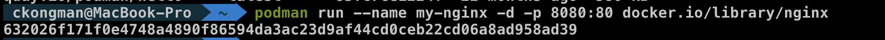 

- `Note:` Because the container is being run in detached mode, represented by the -d in the podman run command, Podman will print the container ID after it has executed the command.

- `Note:` We use port forwarding to be able to access the HTTP server. 

## Listing running containers

- The podman ps command is used to list created and running containers.
  
- type below command or copy and paste to your terminal.
  
  ```
  podman ps
  ```
  
  example output    
  
  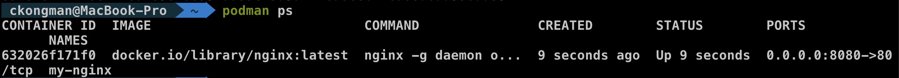 
  
- `Note:` If you add -a to the podman ps command, Podman will show all containers (created, exited, running, etc.).  

## Testing the httpd container

- As you are able to see, the container does not have an IP Address assigned. The container is reachable via it's published port on your local machine.

- type below command or copy and paste to your terminal. 
  
  ```
  curl http://localhost:8080
  ```
  
  example output    

  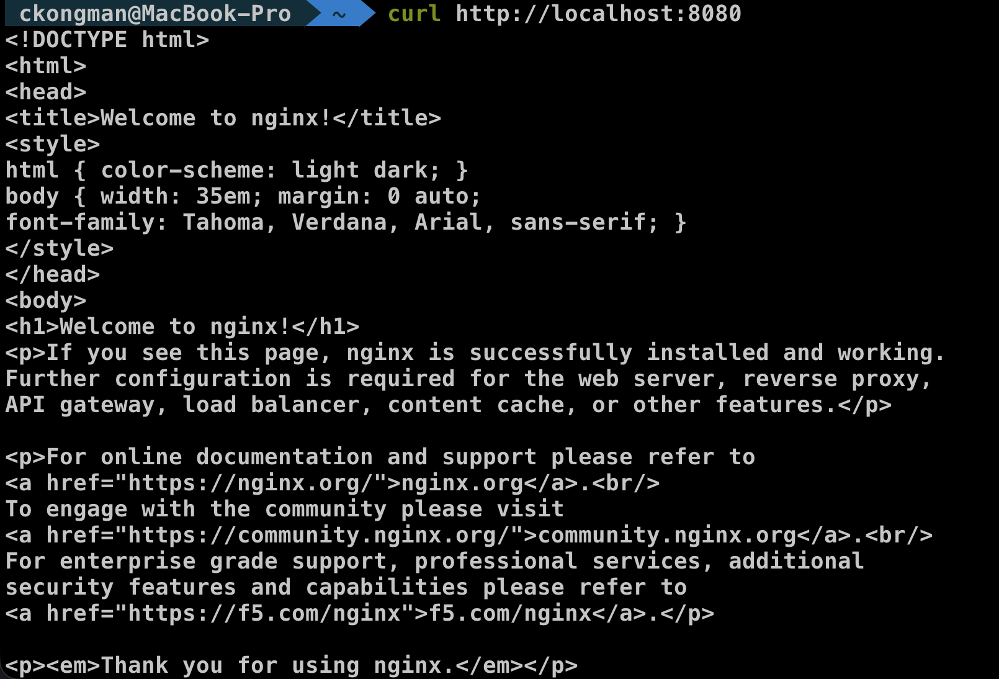 

- Note: Instead of using curl, you can also point a browser to http://localhost:8080.

  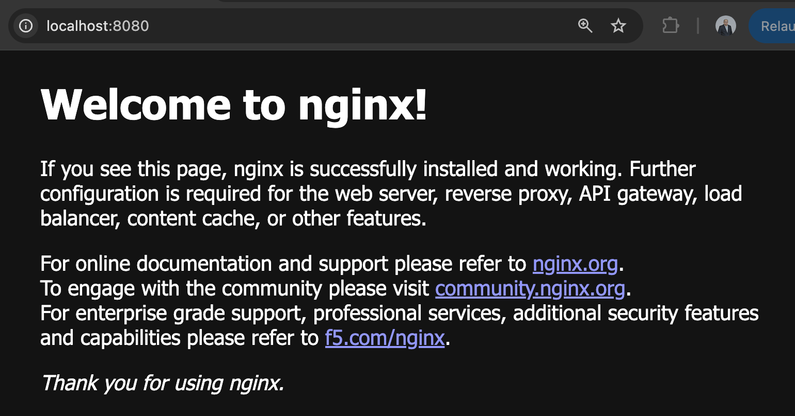

## Inspecting a running container

- You can "inspect" a running container for metadata and details about itself. podman inspect will provide lots of useful information like environment variables, network settings or allocated resources.

- type below command or copy and paste to your terminal. 
  
  ```
  podman inspect my-nginx
  ```
  
  example output    

  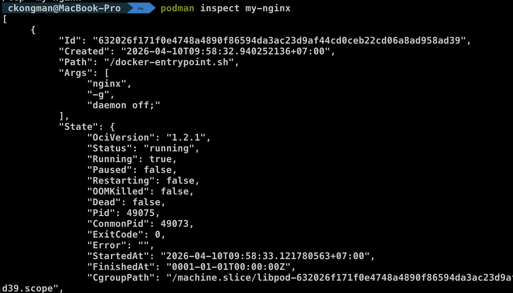 

  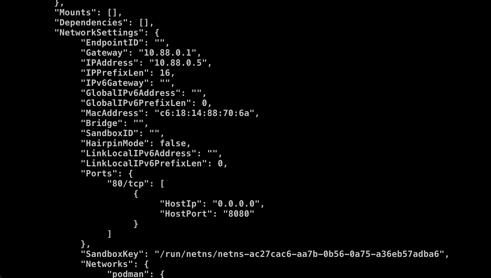 

## Viewing the container's logs

- You can view the container's logs with Podman as well:

- type below command or copy and paste to your terminal. 
  
  ```
  podman logs my-nginx
  ```
  
  example output    
  
  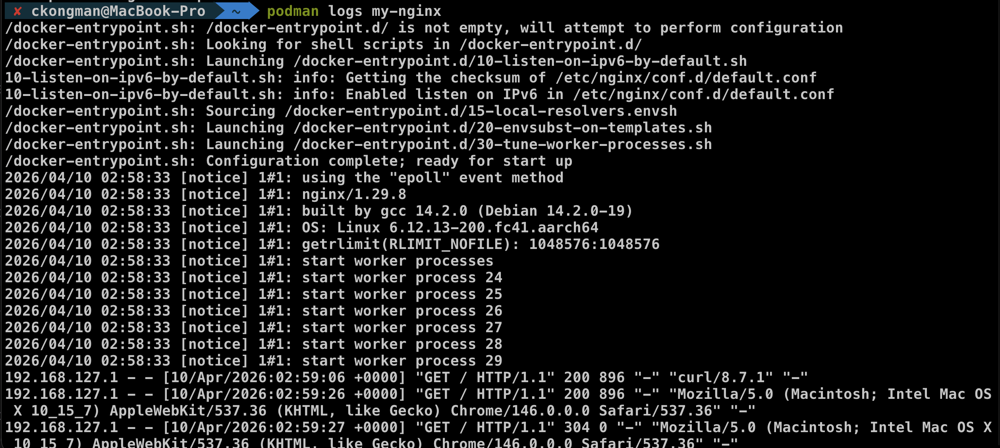 

## Stopping the container

- start with check your container process

- type below command or copy and paste to your terminal. 
  
  ```
  podman ps
  ```
- stop your container with podman stop

- type below command or copy and paste to your terminal. 
  
  ```
  podman stop my-nginx
  ```

- check your container process again

- type below command or copy and paste to your terminal. 
  
  ```
  podman ps
  ```

- check your container process with option -a (all)

- type below command or copy and paste to your terminal. 
  
  ```
  podman ps -a
  ```

- remove container

- type below command or copy and paste to your terminal. 
  
  ```
  podman rm my-nginx
  ```

- check your container process with option -a (all) again

- type below command or copy and paste to your terminal. 
  
  ```
  podman ps -a\
  ```  

  example output
  
  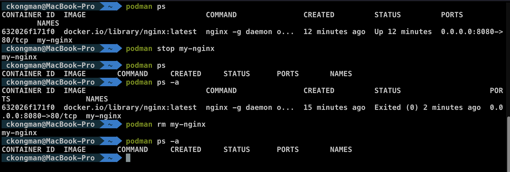 

## Benefits of Knowing Podman Command Line

1. Faster and more efficient workflow

   Using the CLI of Podman lets you run, debug, and manage containers quickly without relying on a GUI—ideal for real-world DevOps work.

2. Automation and CI/CD ready
   Command-line usage is easy to script and integrate into pipelines, making it a natural fit for automation and enterprise workflows.

3. Portable skills across environments
   Podman commands are very similar to Docker, so your skills transfer easily across tools and platforms, including Red Hat OpenShift.

## Back to Table of Content
- [Introduction to Container Technology with Podman](../README.md)