# Build and Manage Container Image
<!-- TOC -->

- [Build and Manage Container Image](#build-and-manage-container-image)
  - [Clone Example from GitHub](#clone-example-from-github)
  - [Build Container with Multi-Stage](#build-container-with-multi-stage)
  - [Build Python Container](#build-python-container)
  - [Build Node.JS Container](#build-nodejs-container)
  - [Build Java Container](#build-java-container)
  - [Tag \& Push Image](#tag--push-image)
  - [Quick challenges](#quick-challenges)
  - [Back to Table of Content](#back-to-table-of-content)

<!-- /TOC -->

## Clone Example from GitHub

- Check your git on machine

- type below command or copy and paste to your terminal.
  
  ```
  git --version
  ```

  example output
  
  ```ssh
  $ git --version
  $ git version 2.40.1
  ```

- Create your directory for source code (50 MB).

- Run the git clone command to get source code from --> https://github.com/chatapazar/podman-workshop.git

- type below command or copy and paste to your terminal.
  
  ```
  cd <your directory>
  git clone https://github.com/chatapazar/podman-workshop.git
  ```

  example output

  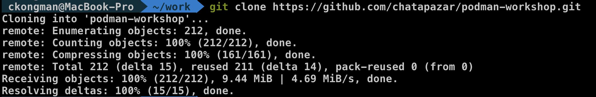

- Review clone folder

- type below command or copy and paste to your terminal. `(Change your command if you are using the Windows OS. such as from ll --> dir)`
  
  ```
  cd <your directory>/podman-workshop
  ll
  ```

  example output

  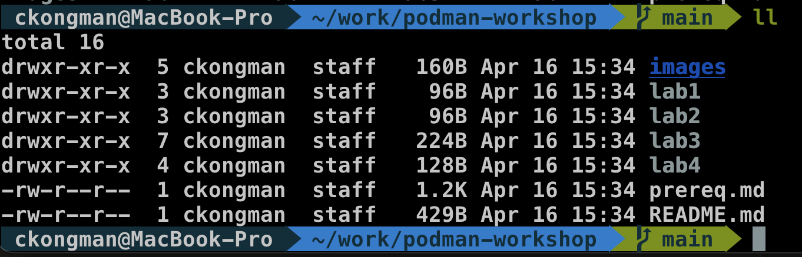

- Open Clone Folder (podman-workshop) with Visual Studio Code (VS Code) or your editor.
  
  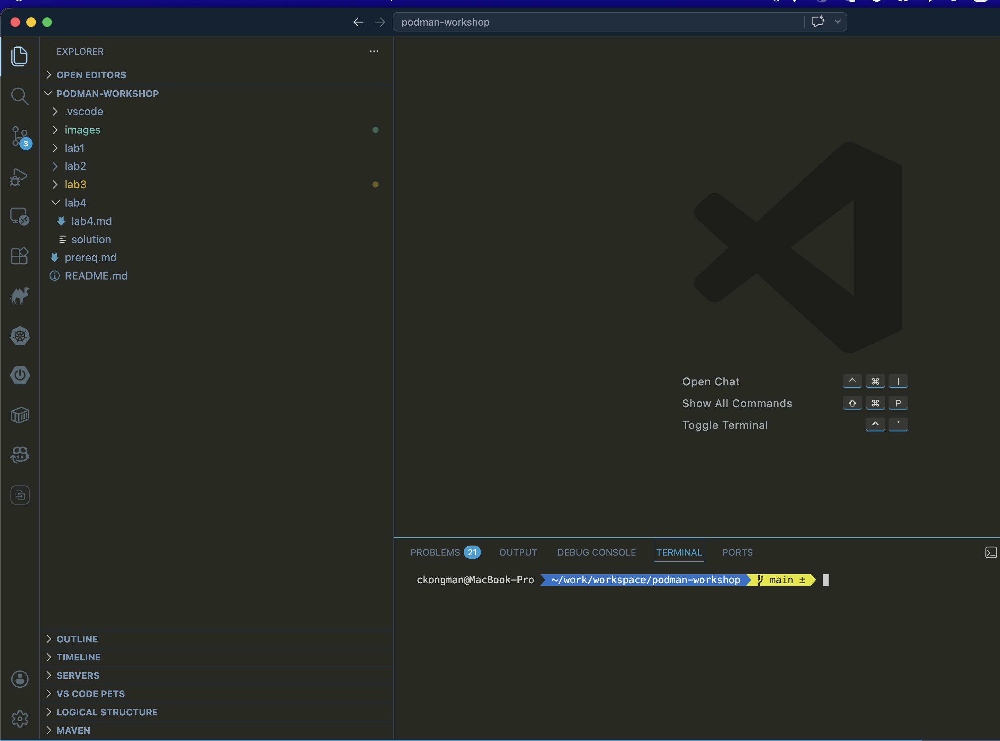

## Build Container with Multi-Stage

Since the purpose of this lab is to introduce how to build containers for each programming language, the lab has prepared source code and uses a multi-stage build method. This avoids having to build the application in each language on the machine where the lab will be held, thereby reducing the problems associated with preparing the environment.

  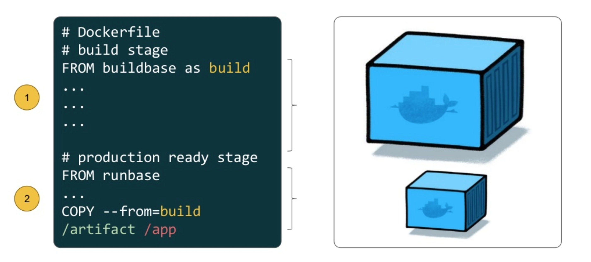

## Build Python Container

  

- Review source code, From VSCode, go to podman-workshop > lab3 > python
  
- Review file podman-workshop > lab3 > python > backend > app.py, check port = 8080 and render template `index.html`
  
  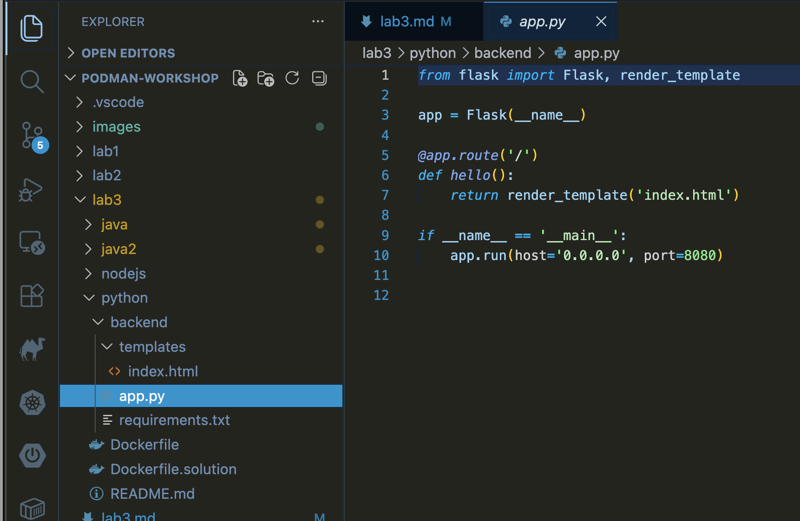

- Review file podman-workshop > lab3 > python > backend > templates > index.html, check body is `Hello from Flask!`, 

- [Flask](https://github.com/pallets/flask) 
  
  Flask is a lightweight WSGI web application framework. It is designed to make getting started quick and easy, with the ability to scale up to complex applications. It began as a simple wrapper around Werkzeug and Jinja, and has become one of the most popular Python web application frameworks.

  Flask offers suggestions, but doesn't enforce any dependencies or project layout. It is up to the developer to choose the tools and libraries they want to use. There are many extensions provided by the community that make adding new functionality easy.

  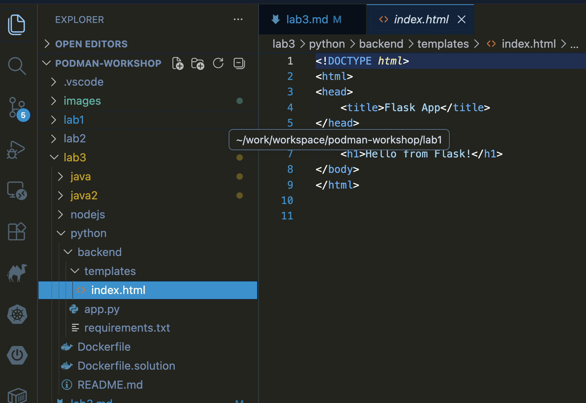   

- Review file podman-workshop > lab3 > python > backend > requirements.txt,  
  
  A requirements.txt file is a plain-text document used in Python development to list all the external libraries (dependencies) a project needs to run. It ensures that any developer or deployment system can recreate the exact same environment by installing the correct versions of these packages. 

  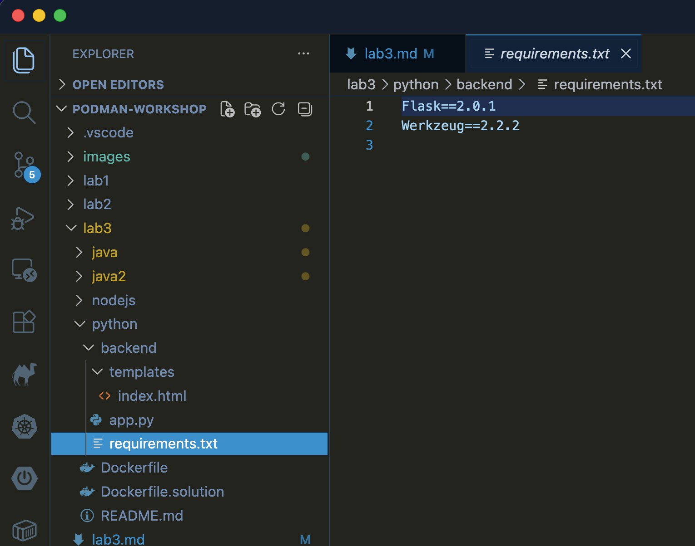

- Review file podman-workshop > lab3 > python > backend > Dockerfile  

  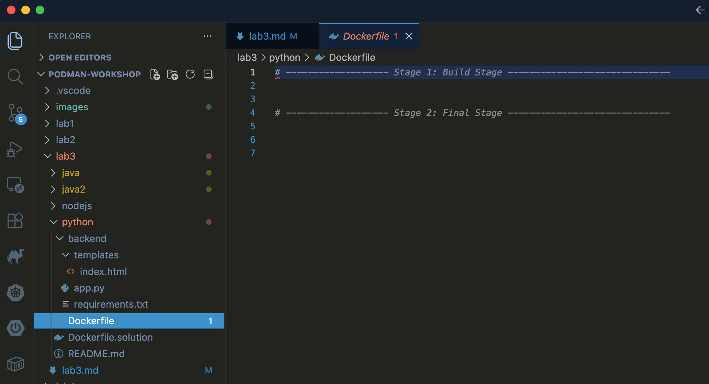

- Edit Dockerfile in Stage 1 with below code.
  
  - used `python:3.9` as builder image 
  
  - set work directory as `/app`

  - copy source code from backend folder to /app (represent with `.`) 
  
  - install depencies in requirements.txt
  
  ```
  # ------------------- Stage 1: Build Stage ------------------------------
  FROM python:3.9 AS backend-builder

  # Set the working directory to /app
  WORKDIR /app

  # Copy the contents of the backend directory into the container at /app
  COPY backend/ .

  # Install dependencies specified in requirements.txt
  RUN pip install --no-cache-dir -r requirements.txt
  ```

- Edit Dockerfile in Stage 2 with below code.
  
  - used `python:3.9-slim` as runtime image 
  
  - set work directory as `/app`

  - copy the built dependencies from the backend-builder stage 

  - Copy the application code from the backend-builder stage

  - expose port 8080
  
  - set default command to run `python app.py`
  
  ```
  # ------------------- Stage 2: Final Stage ------------------------------

  # Use a slim Python 3.9 image as the final base image
  FROM python:3.9-slim

  # Set the working directory to /app
  WORKDIR /app

  # Copy the built dependencies from the backend-builder stage
  COPY --from=backend-builder /usr/local/lib/python3.9/site-packages/ /usr/local/lib/python3.9/site-packages/

  # Copy the application code from the backend-builder stage
  COPY --from=backend-builder /app /app

  # Expose port 8080 for the Flask application
  EXPOSE 8080

  # Define the default command to run the application
  CMD ["python", "app.py"]
  ```

- Review final Dockerfile 

  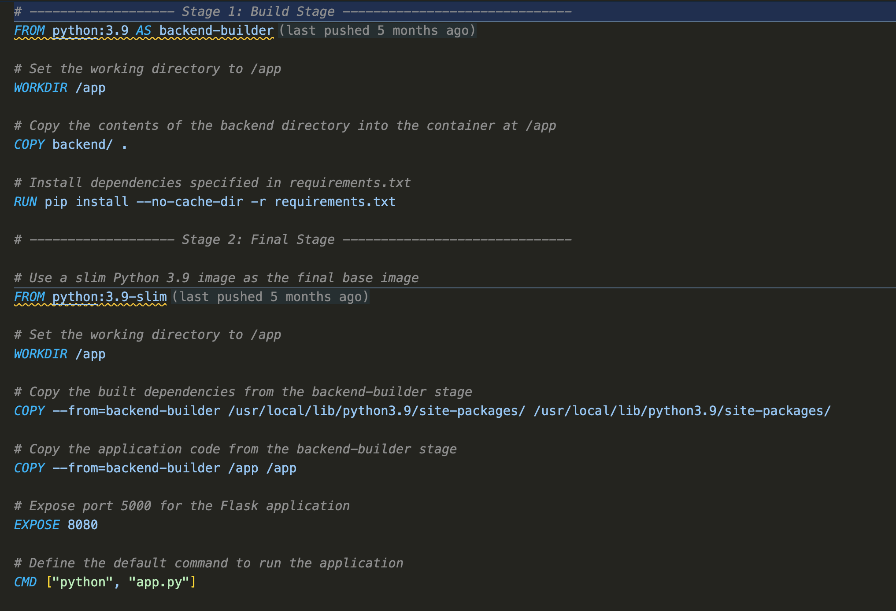  

- build image with podman, open your terminal (command prompt/powershell)

- type below command or copy and paste to your terminal.
  
  ```
  cd <your directory>/podman-workshop/lab3/python
  podman build -f Dockerfile -t my-python .
  ```

  example output

  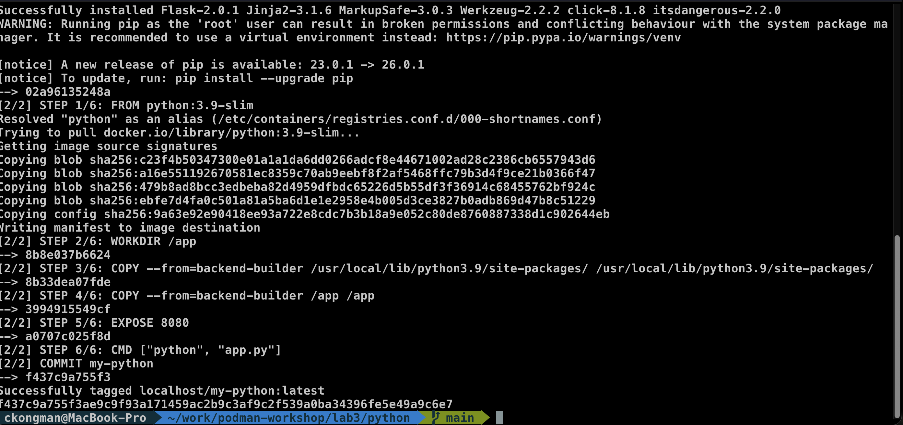  

- `Note:` Since there is no base image on the local machine, pulling the image will take time. This can reduce build time by pulling a pre-built image.
  
- Check images `my-python` after build

- type below command or copy and paste to your terminal.
  
  ```
  podman images
  ```

  example output

  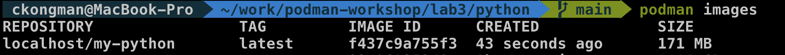  

- Run Container with podman run 

- type below command or copy and paste to your terminal.
  
  ```
  podman run -d -p 8080:8080 --name my-python-app localhost/my-python
  ```

- Check container process.

- type below command or copy and paste to your terminal.
  
  ```
  podman ps
  ```
  
  example output

  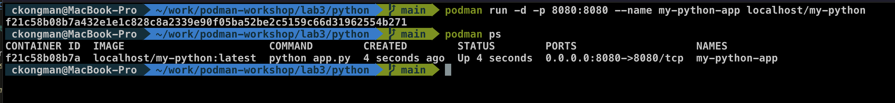

- Open Browser to `http://locahost:8080`

  example output
  
  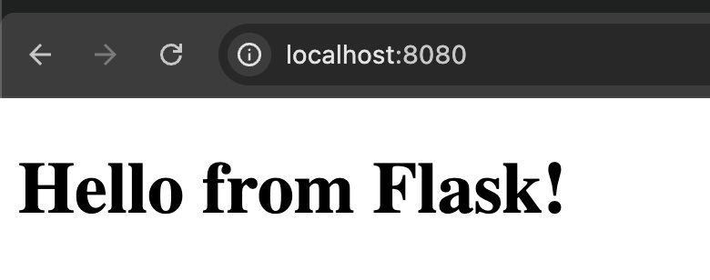

- Stop and remove container

- type below command or copy and paste to your terminal.
  
  ```
  podman stop my-python-app
  podman rm my-python-app
  ```
  
  example output    

  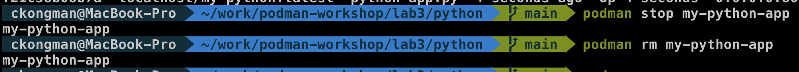

- Check container process.

- type below command or copy and paste to your terminal.
  
  ```
  podman ps
  ```
  
  example output

  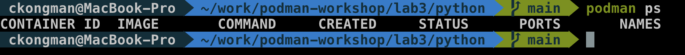                

## Build Node.JS Container

  

- Review source code, From VSCode, go to podman-workshop > lab3 > nodejs

- Review file podman-workshop > lab3 > nodejs > src > server.ts, check port = 3000 and message = `Hello from TypeScript Podman!`

  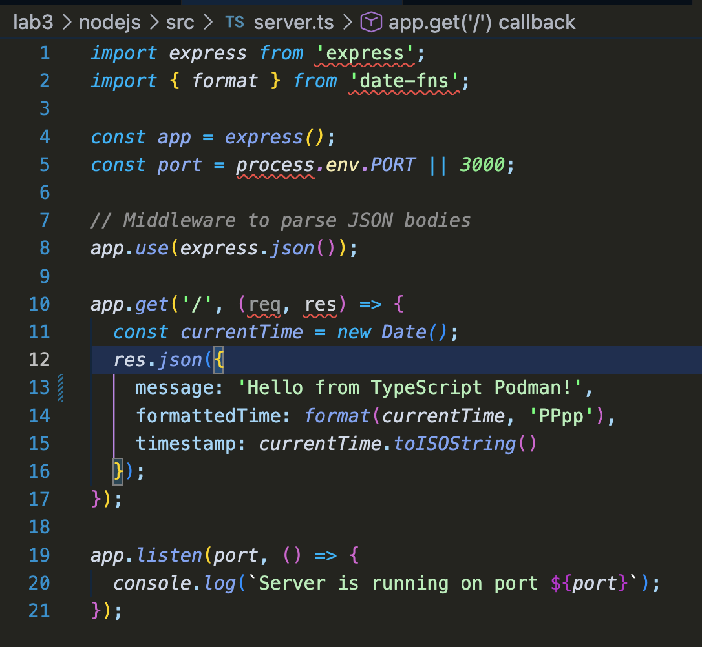  

- Review file podman-workshop > lab3 > nodejs > package.json and package-lock.json  

  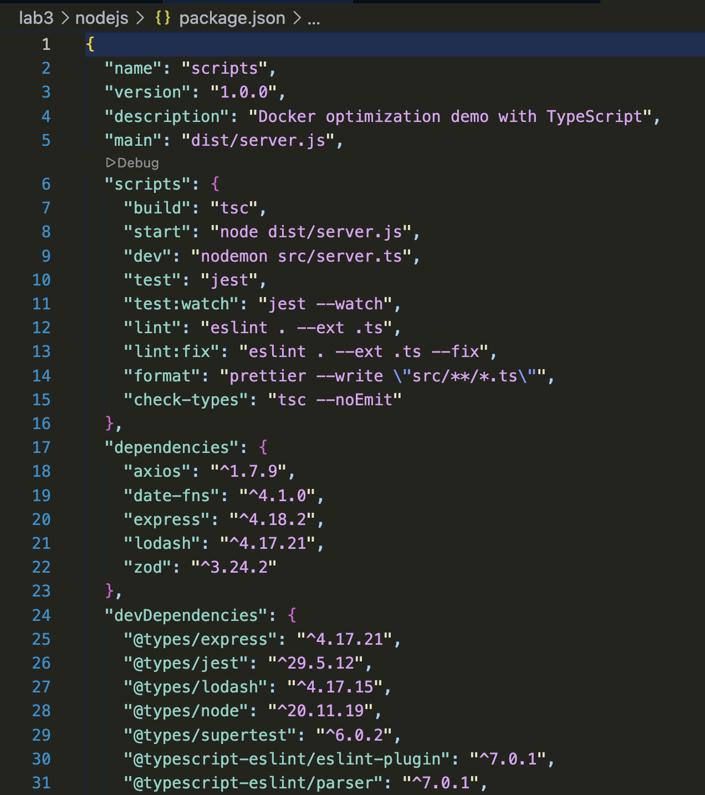

- `Note:` In Node.js, package.json and package-lock.json are essential files used by the npm (Node Package Manager) to manage a project's dependencies, metadata, and scripts. While they work together, they serve distinct purposes in ensuring your application runs consistently across different environments.  

- Review file podman-workshop > lab3 > nodejs > tsconfig.json 

  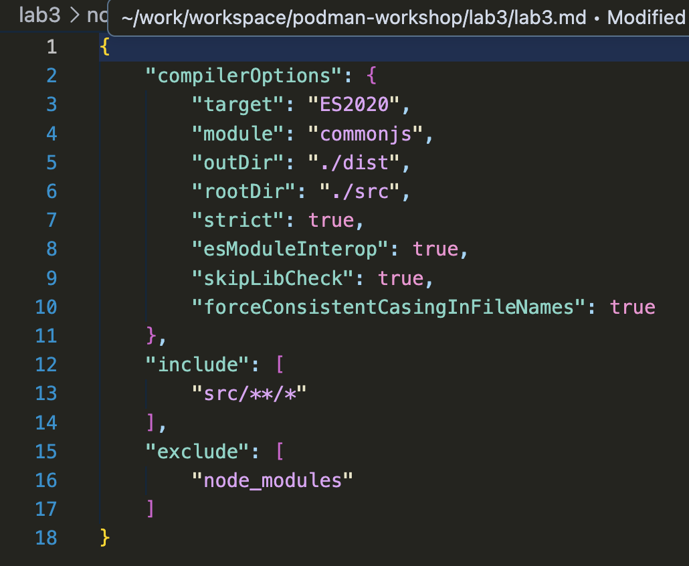

- `Note:` A tsconfig.json file is the configuration file for a TypeScript project. Its presence in a directory indicates that the directory is the root of a TypeScript project and specifies the compiler options required to compile the code. 

- Review file podman-workshop > lab3 > nodejs > Dockerfile  

  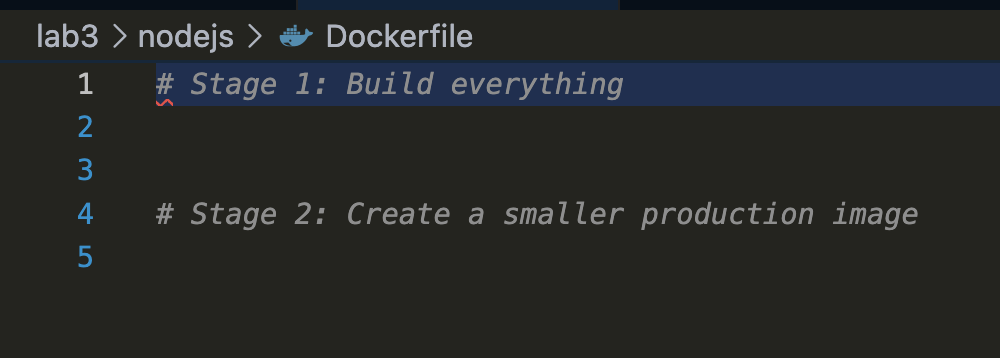

- Edit Dockerfile in Stage 1 with below code.
  
  - used `node:22-alpine` as builder image 
  
  - set work directory as `/app`

  - copy package.json and package-lock.json to folder /app (represent with `.`) 
  
  - run npm ci for install dependencies
  
  - copy dependencies to folder /app

  - compile with npm run build
  
  ```
  # Stage 1: Build everything
  FROM node:22-alpine AS builder
  WORKDIR /app
  COPY package.json package-lock.json ./
  RUN npm ci
  COPY . .
  RUN npm run build
  ```

- Edit Dockerfile in Stage 2 with below code.
  
  - used `node:22-alpine` as runtime image 
  
  - set work directory as `/app`

  - copy folder /app/dist from builder to current image folder dist

  - Copy package.json package-lock.json to work folder

  - clean install exclude dev dependencies
  
  - set default command to run `node dist/server.js`
  
  ```
  # Stage 2: Create a smaller production image
  FROM node:22-alpine
  WORKDIR /app
  COPY --from=builder /app/dist ./dist
  COPY package.json package-lock.json ./
  RUN npm ci --omit=dev
  CMD ["node", "dist/server.js"]
  ```

- `Note:` The command npm ci --omit=dev is used to perform a "clean install" of your project's dependencies while specifically excluding those listed in the devDependencies section of your package.json. It is primarily used in production environments and CI/CD pipelines to create a lightweight, production-ready node_modules folder. 

- Review final Dockerfile 

  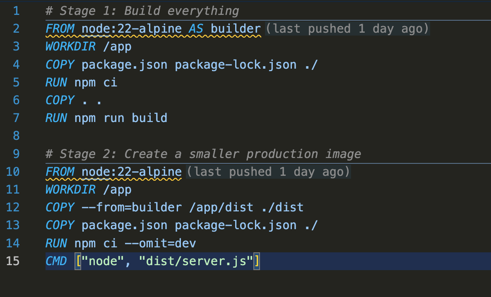  

- build image with podman, open your terminal (command prompt/powershell)

- type below command or copy and paste to your terminal.
  
  ```
  cd <your directory>/podman-workshop/lab3/nodejs
  podman build -f Dockerfile -t my-nodejs .
  ```

  example output

  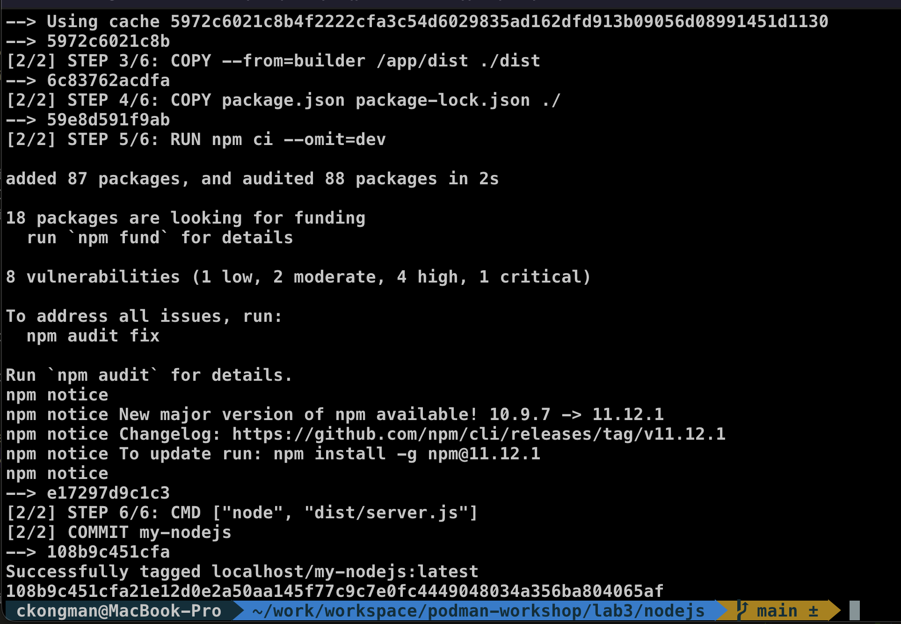  

- `Note:` Since there is no base image on the local machine, pulling the image will take time. This can reduce build time by pulling a pre-built image.
  
- Check images `my-python` after build

- type below command or copy and paste to your terminal.
  
  ```
  podman images
  ```

  example output

  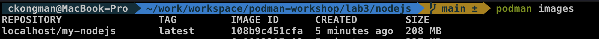  

- Run Container with podman run 

- type below command or copy and paste to your terminal.
  
  ```
  podman run -d -p 3000:3000 --name my-nodejs-app localhost/my-nodejs
  ```

- Check container process.

- type below command or copy and paste to your terminal.
  
  ```
  podman ps
  ```
  
  example output

  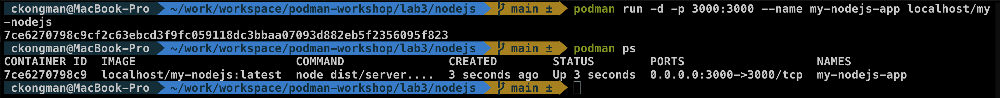

- Open Browser to `http://locahost:3000`

  example output
  
  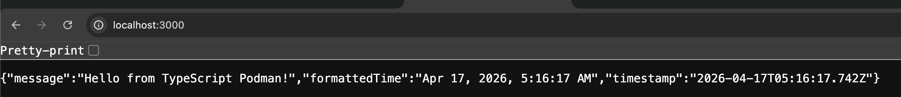

- Stop and remove container

- type below command or copy and paste to your terminal.
  
  ```
  podman stop my-nodejs-app
  podman rm my-nodejs-app
  ```
  
  example output    

  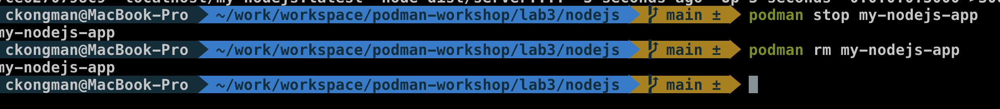

- Check container process.

- type below command or copy and paste to your terminal.
  
  ```
  podman ps
  ```
  
  example output

  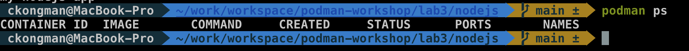   

## Build Java Container

  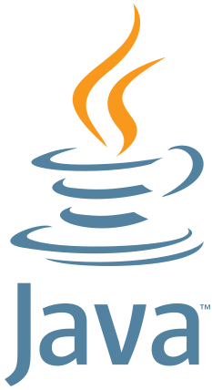

- Review source code, From VSCode, go to podman-workshop > lab3 > java

- Review file podman-workshop > lab3 > java > src > main > java > com > example > springboot > HelloController.java

  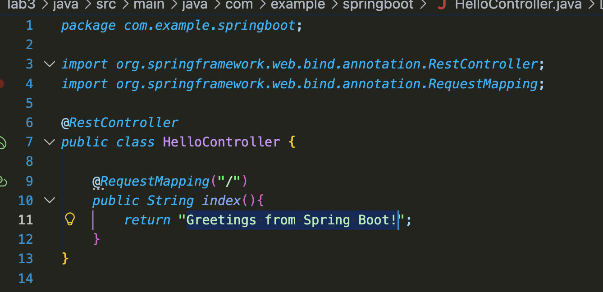  

- Review file podman-workshop > lab3 > java > pom.xml 

  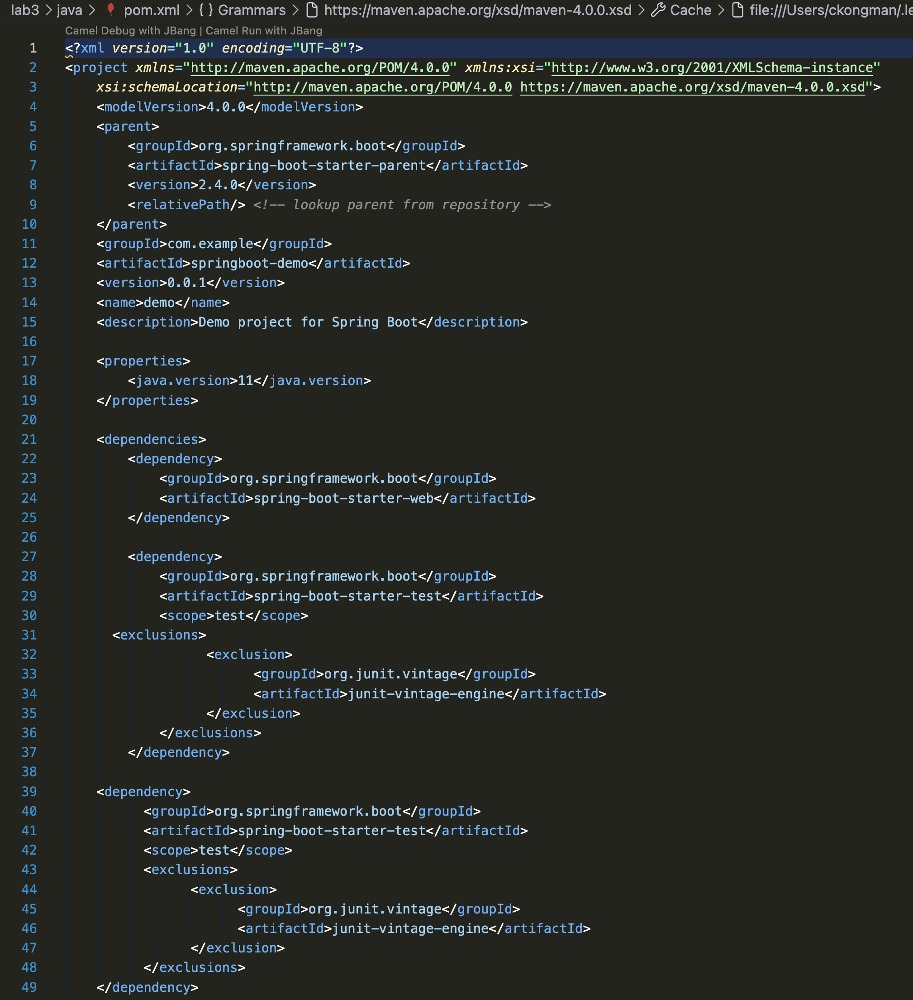

- `Note:` A Project Object Model (POM) file, named pom.xml, is the fundamental unit of work in Apache Maven. It is an XML file located in the project's base directory that contains all the configuration details required to build a project, manage its dependencies, and define its lifecycle. 

- `Note:` [Apache Maven](https://maven.apache.org/) is a build tool for Java projects. Using a project object model (POM), Maven manages a project's compilation, testing, and documentation.

- Review file podman-workshop > lab3 > java > Dockerfile  

  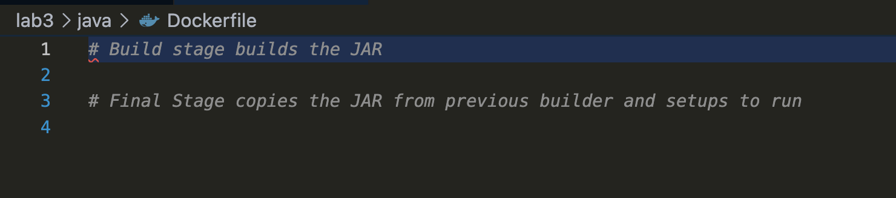

- Edit Dockerfile in Build Stage with below code.
  
  - used `maven:3` as builder image 
  
  - create folder build

  - copy all file to build folder
  
  - set work directory to build folder
  
  - run maven build
  
  ```
  # Build stage builds the JAR
  FROM maven:3 AS builder

  # make build directory
  RUN mkdir /build

  # Copy Files into build container
  COPY . /build

  # Change to build directroy
  WORKDIR /build

  # package the java application
  RUN mvn package
  ```

- Edit Dockerfile in Final Stage with below code.
  
  - used `eclipse-temurin:17.0.18_8-jre-ubi10-minimal` as runtime image 
  
  - copy jar file from builder stage to app.jar

  - set entry point to start app with java -jar app.jar
  
  ```
  # Final Stage copies the JAR from previous builder and setups to run
  FROM eclipse-temurin:17.0.18_8-jre-ubi10-minimal

  # Copy JAR from builder changing ownership to java user
  COPY --from=builder /build/target/*.jar app.jar

  # Set entry point to start app
  ENTRYPOINT ["java","-jar","/app.jar"]
  ```

- Review final Dockerfile 

  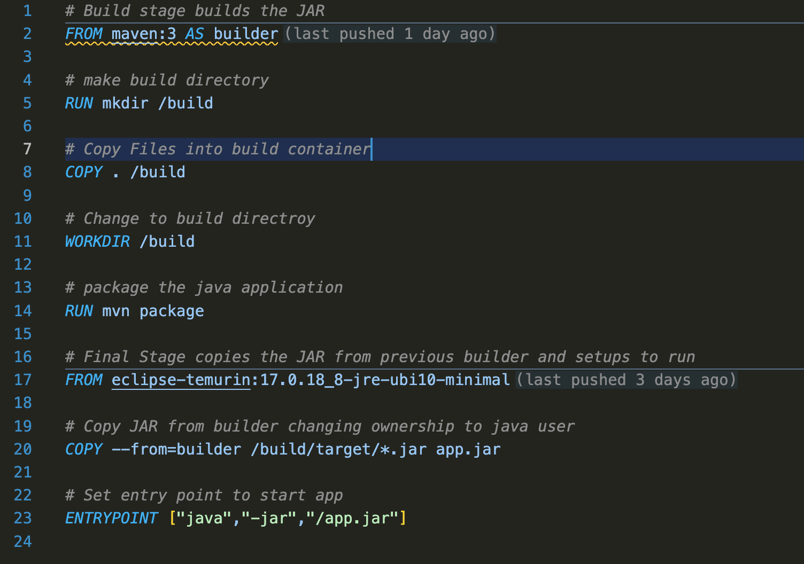  

- build image with podman, open your terminal (command prompt/powershell)

- type below command or copy and paste to your terminal.
  
  ```
  cd <your directory>/podman-workshop/lab3/java
  podman build -f Dockerfile -t my-java .
  ```

  example output

  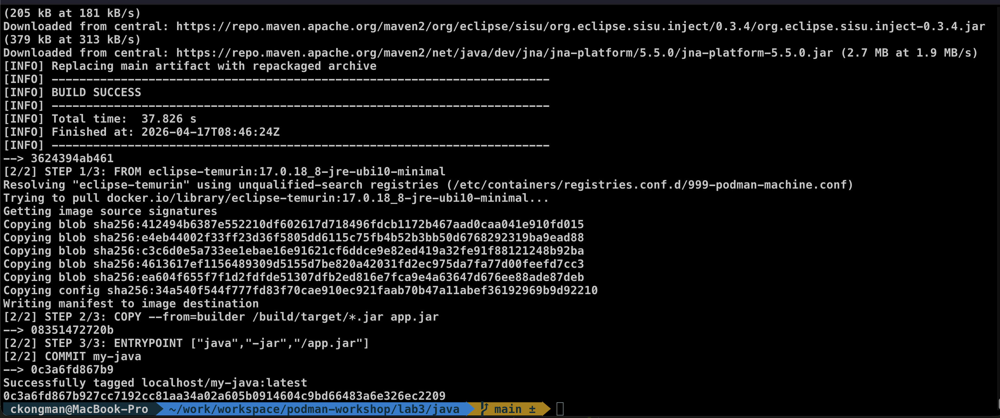  

- `Note:` Since there is no base image on the local machine, pulling the image will take time. This can reduce build time by pulling a pre-built image.
  
- Check images `my-java` after build

- type below command or copy and paste to your terminal.
  
  ```
  podman images
  ```

  example output

  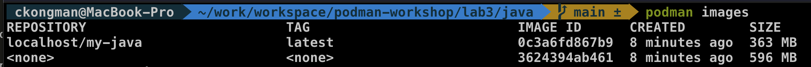  

- Run Container with podman run 

- type below command or copy and paste to your terminal.
  
  ```
  podman run -d -p 8080:8080 --name my-java-app localhost/my-java
  ```

- Check container process.

- type below command or copy and paste to your terminal.
  
  ```
  podman ps
  ```
  
  example output

  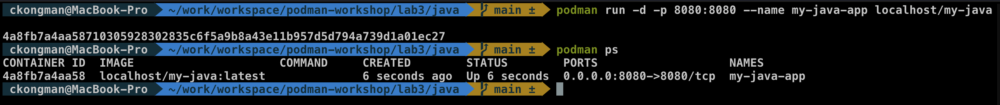

- Open Browser to `http://locahost:8080`

  example output
  
  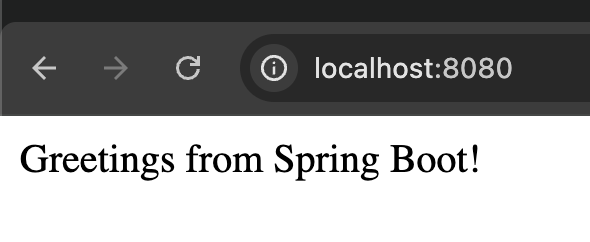

- Stop and remove container

- type below command or copy and paste to your terminal.
  
  ```
  podman stop my-java-app
  podman rm my-java-app
  ```
  
  example output    

  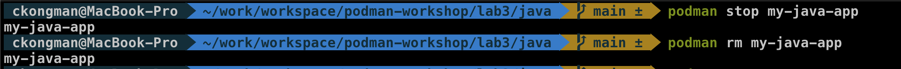

- Check container process.

- type below command or copy and paste to your terminal.
  
  ```
  podman ps
  ```

  example output

     

## Tag & Push Image

- `The podman login` command is used to authenticate with a container registry (such as Docker Hub, Quay.io, or a private registry). Once logged in, you can pull private images or push your own images to the registry. 

- `The podman tag` command adds an additional name (and optionally a version tag) to a local image. This does not duplicate the image data; it simply creates a new reference pointing to the same Image ID. 

- `The podman push` command is used to upload container images from your local storage to a remote container registry or other storage destinations. It is a direct, daemonless alternative to the docker push command. 

- Review current images in local machine
  
- type below command or copy and paste to your terminal.
  
  ```
  podman images
  ```

  example output   

  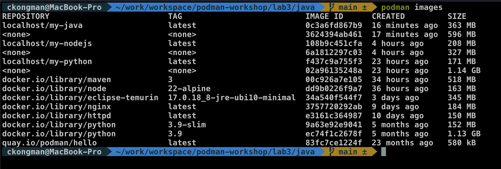   

- Login to Dockerhub with your username

- type below command or copy and paste to your terminal.
  
  ```
  podman login docker.io
  username: <yourusername>
  password: <yourpassword>
  ```
  
  example output   
  
  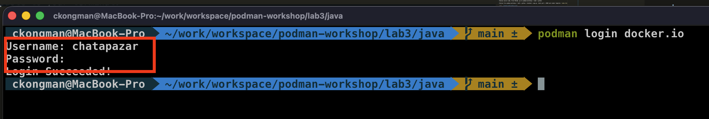   

- Check login status

- type below command or copy and paste to your terminal.
  
  ```
  podman login --get-login docker.io
  ```
  
  example output   
  
  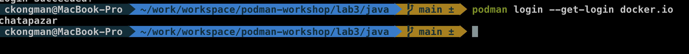   

- Tag your java image to v1.0
  
- type below command or copy and paste to your terminal.
  
  ```
  podman tag localhost/my-java docker.io/<username>/my-java:v1.0
  podman images
  ```
  
  example output   
  
  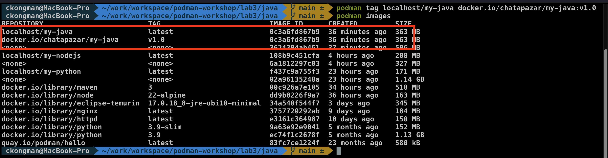    

- push image to image repository 
  
- type below command or copy and paste to your terminal.
  
  ```
  podman push docker.io/<username>/my-java:v1.0
  ```
  
  example output   
  
  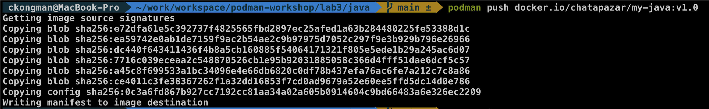    

- Open Browser and Login to your username at [DockerHub](https://hub.docker.com/)
  
- Check new image push to your repository
  
  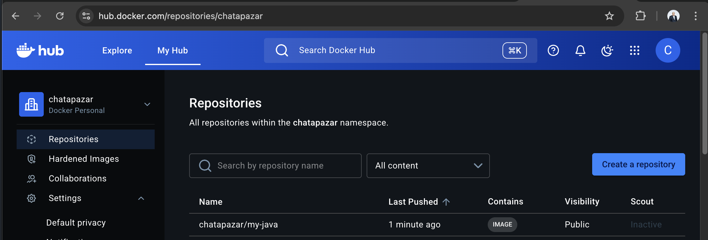    
  
  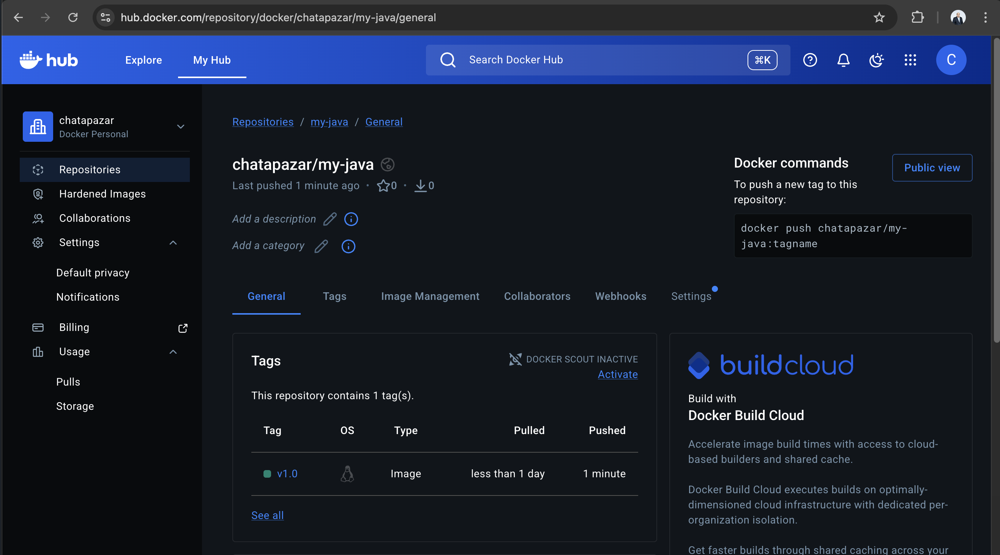        

## Quick challenges

- What is the image in the picture?

  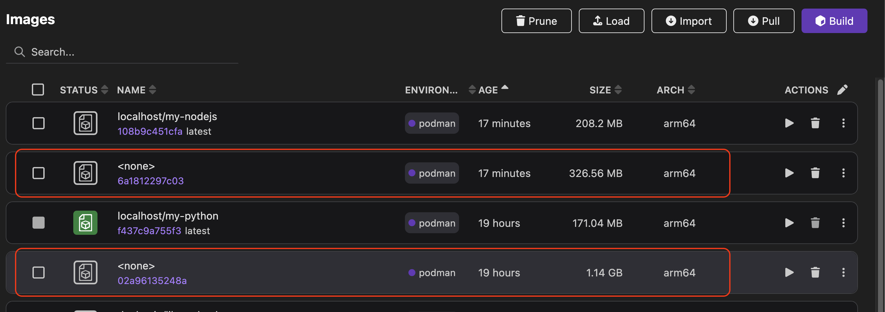   

## Back to Table of Content

- [Introduction to Container Technology with Podman](../README.md)